# Objective

Create an AWS Lambda function that is triggered by S3 uploads (put events) of CSV files. The function must validate the contents of each CSV file for specific rules, and send an SNS notification if any file is invalid, with error details.

## Requirements

- Trigger: S3 ObjectCreated:Put events, for a specified bucket and for files with .csv extension.
- Input: Each event may include multiple records.
- Processing: For each file uploaded:
  - Download the CSV from S3.
  - Validate that the CSV:
    - Has a header row containing: user_id, email, signup_date
  - Each row:
    - user_id is non-empty and alphanumeric.
    - email is a valid email address.
    - signup_date is in YYYY-MM-DD format and not in the future.
- SNS Alert:(Bonus)
  - If any validation fails, send an SNS message to a configured topic with:
    - S3 bucket
    - File name
    - Line number and description of first error found
    - If all rows pass, no alert is sent.
- Logging: Log every processed file, including if it was valid or invalid (and reason for failure).

## SOLUTION

## Step 1: Create an SNS Topic for Notifications

### 1.1 Navigate to SNS

1. Open AWS Console and search for "SNS"
2. Click on "Simple Notification Service"

### 1.2 Create Topic

1. Click **"Create topic"**
2. Select **"Standard"** type
3. **Name**: `csv-validation-alerts`
4. Leave other settings as default
5. Click **"Create topic"**
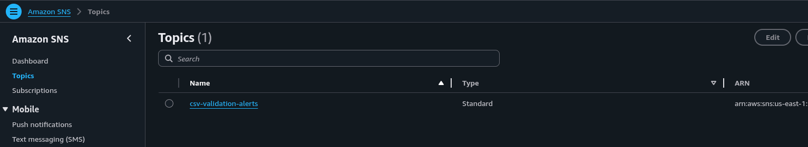

### 1.3 Subscribe to Topic (to receive notifications)

1. In the topic details page, click **"Create subscription"**
2. **Protocol**: Select "Email"
3. **Endpoint**: Enter your email address
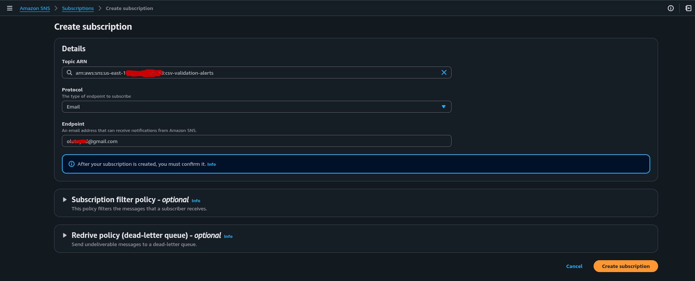
4. Click **"Create subscription"**
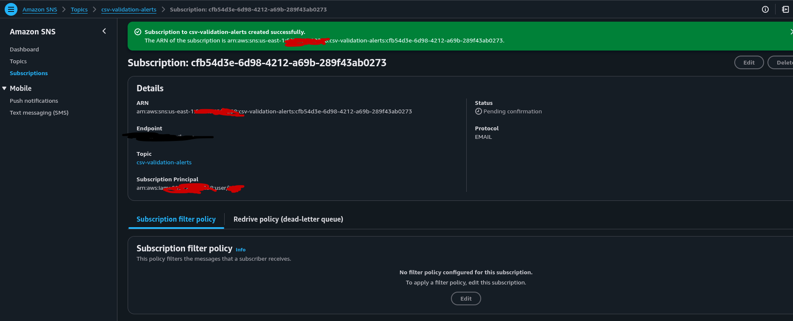

5. **Important**: Check your email and click the confirmation link

### 1.4 Copy the Topic ARN

- Copy the **Topic ARN** (looks like: `arn:aws:sns:us-east-1:123456789012:csv-validation-alerts`)
- Save this - you'll need it later

---

## Step 2: Create the S3 Bucket

### 2.1 Navigate to S3

1. Search for "S3" in AWS Console
2. Click on "S3"

### 2.2 Create Bucket

1. Click **"Create bucket"**
2. **Bucket name**: Choose a unique name (e.g., `my-csv-uploads-bucket-12345`)
3. **Region**: Choose your preferred region (remember this)
4. Leave other settings as default
5. Click **"Create bucket"**
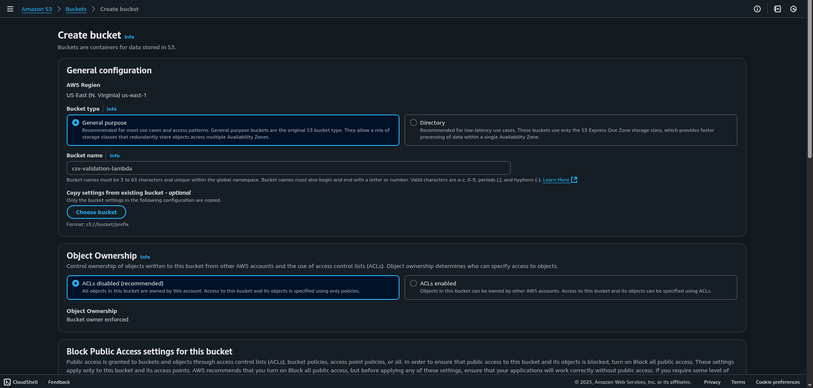

### 2.3 Note Your Bucket Name

- Save the bucket name - you'll need it later

---

## Step 3: Create IAM Role for Lambda

### 3.1 Navigate to IAM

1. Search for "IAM" in AWS Console
2. Click on "IAM"

### 3.2 Create Role

1. Click **"Roles"** in left sidebar
2. Click **"Create role"**
3. **Trusted entity type**: Select "AWS service"
4. **Service**: Select "Lambda"
5. Click **"Next"**
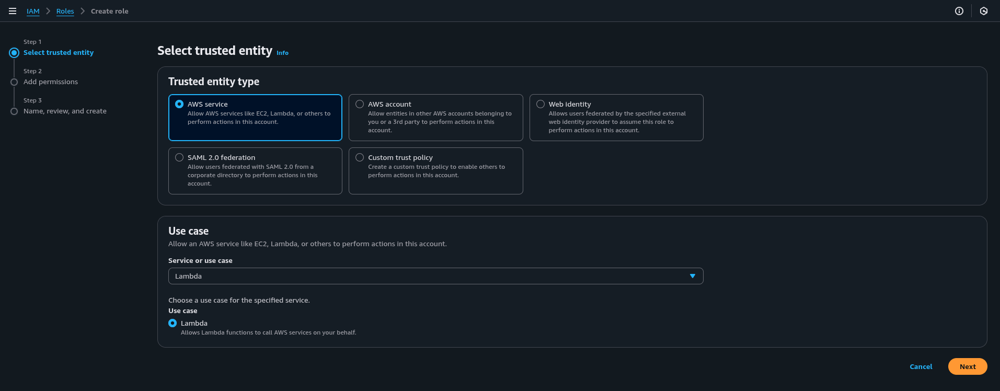

### 3.3 Attach Policies

1. Search and select these policies:
   - `AWSLambdaBasicExecutionRole` (for CloudWatch logs)
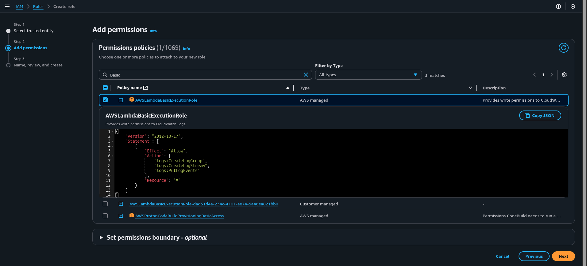
2. Click **"Next"**

### 3.4 Name the Role

1. **Role name**: `CSVValidatorLambdaRole`
2. Click **"Create role"**
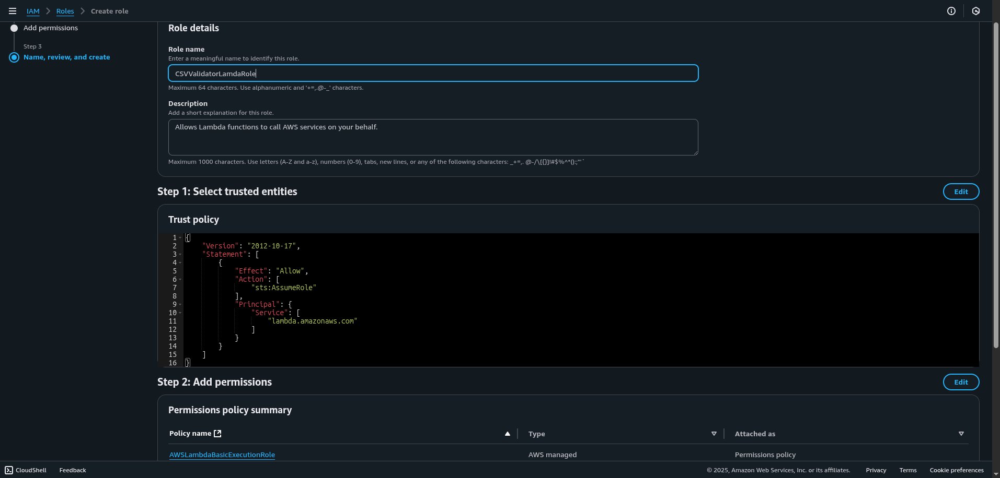

### 3.5 Add Custom Permissions

1. Find your newly created role and click on it
2. Click **"Add permissions"** → **"Create inline policy"**

3. Click **"Next"**
4. **Policy name**: `CSVValidatorCustomPolicy`
5. Click **"Create policy"**
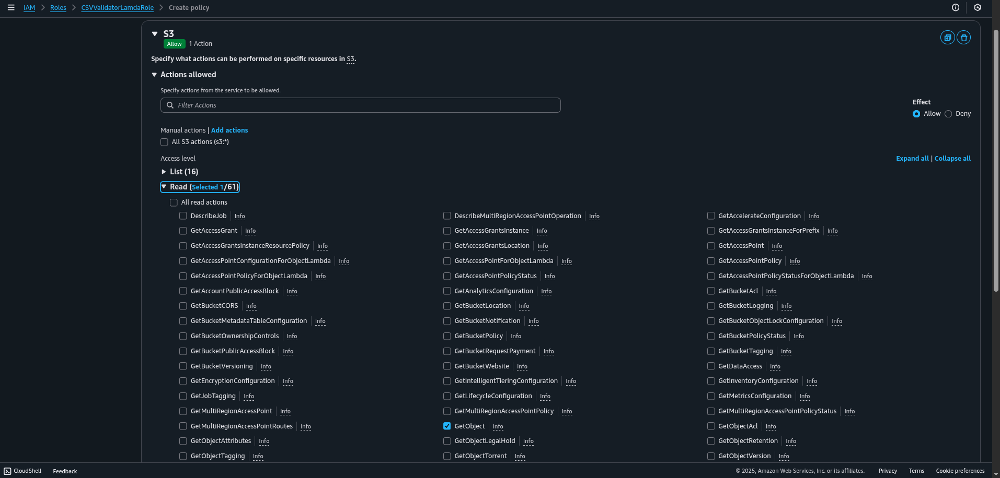

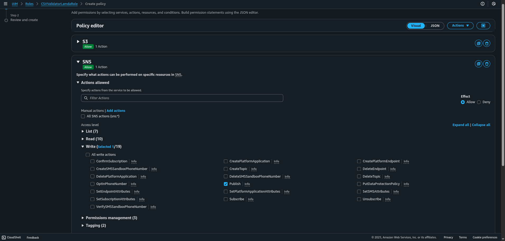
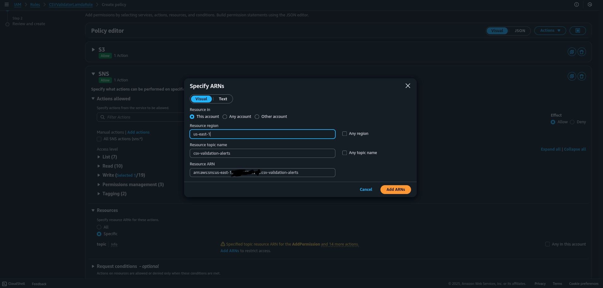

---

## Step 4: Create the Lambda Function

### 4.1 Navigate to Lambda

1. Search for "Lambda" in AWS Console
2. Click on "Lambda"

### 4.2 Create Function

1. Click **"Create function"**
2. Select **"Author from scratch"**
3. **Function name**: `csv-validator`
4. **Runtime**: Select "Python 3.9"
5. **Architecture**: x86_64
6. **Execution role**: Select "Use an existing role"
7. **Existing role**: Select `CSVValidatorLambdaRole`
8. Click **"Create function"**

### 4.3 Configure Function Settings

1. In the function page, scroll to **"Configuration"** tab
2. Click **"General configuration"** → **"Edit"**
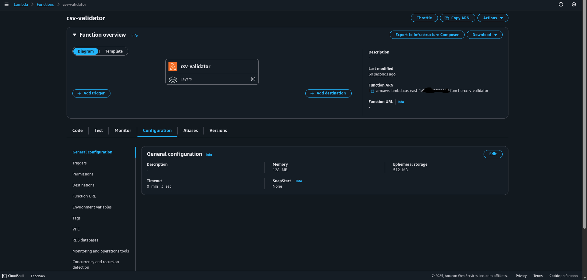
3. **Timeout**: Change to `1 min 0 sec`
4. **Memory**: Change to `256 MB`
5. Click **"Save"**
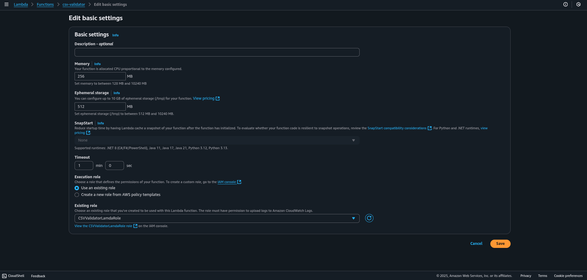

### 4.4 Add Environment Variable

1. Still in **"Configuration"** tab, click **"Environment variables"**
2. Click **"Edit"**
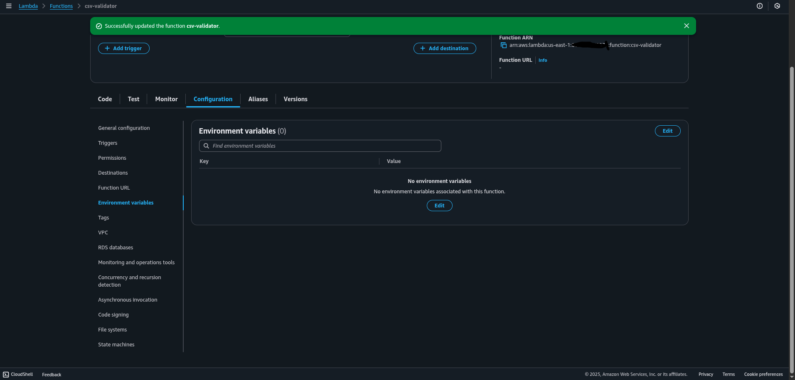
3. Click **"Add environment variable"**
4. **Key**: `SNS_TOPIC_ARN`
5. **Value**: Paste your SNS Topic ARN from Step 1.4
6. Click **"Save"**
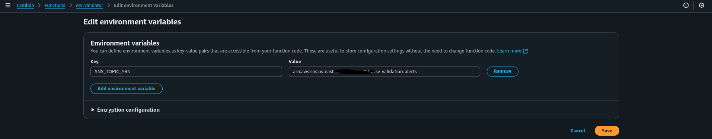

### 4.5 Add the Function Code

1. Go back to **"Code"** tab
2. Delete all existing code in `lambda_function.py`
3. Copy and paste the complete [Lambda function](lambda_function.py)
4. Click **"Deploy"**
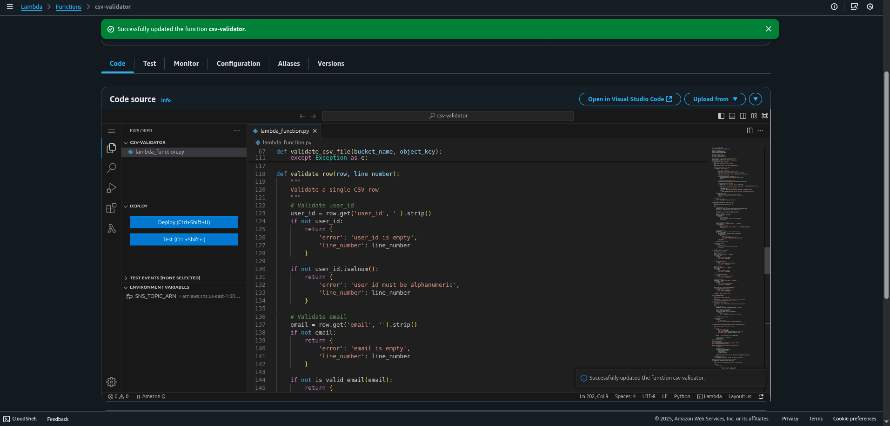

---

## Step 5: Set Up S3 Trigger

### 5.1 Add S3 Trigger to Lambda

1. In your Lambda function page, click **"Add trigger"**
2. **Source**: Select "S3"
3. **Bucket**: Select your bucket from Step 2
4. **Event type**: Select "PUT"
5. **Suffix**: Enter `.csv`
6. **Acknowledge**: Check the box about recursive invocation
7. Click **"Add"**
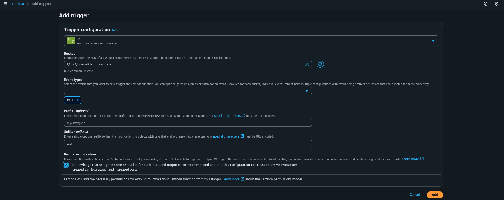

---

## Step 6: Test the Setup

### 6.1 Create Test CSV Files

**Create a [valid CSV file](valid_test.csv)**

**Create an [invalid CSV file](invalid_test.csv)**

### 6.2 Upload Files to S3

1. Go to your S3 bucket
2. Click **"Upload"**
3. Add both CSV files
4. Click **"Upload"**
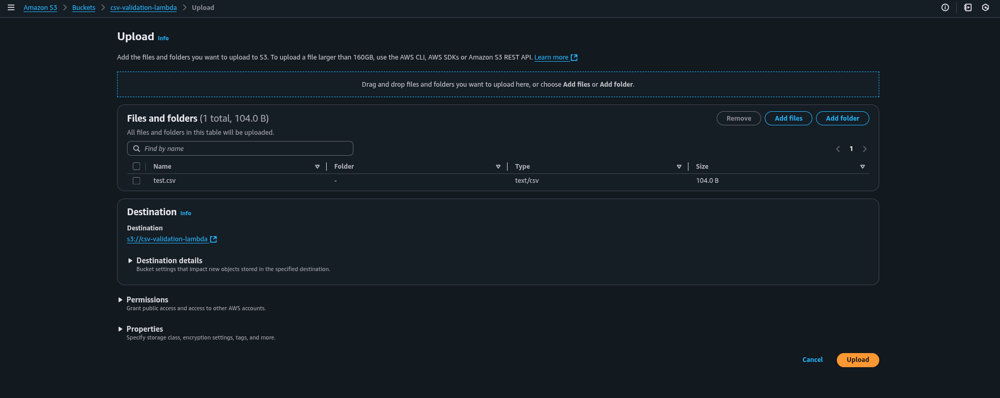

### 6.3 Check Results

**Check CloudWatch Logs:**

1. Go to CloudWatch → Log groups
2. Find `/aws/lambda/csv-validator`
3. Check the latest log stream
4. You should see processing logs for both files
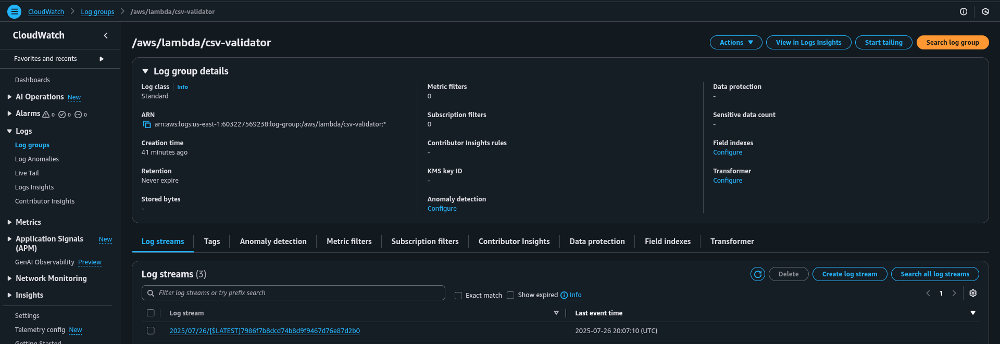
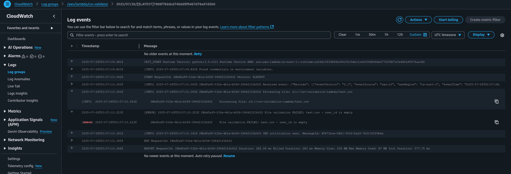
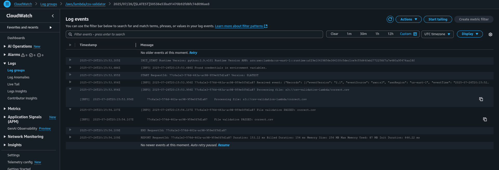

**Check Email:**

- You should receive an SNS email notification for the invalid file only
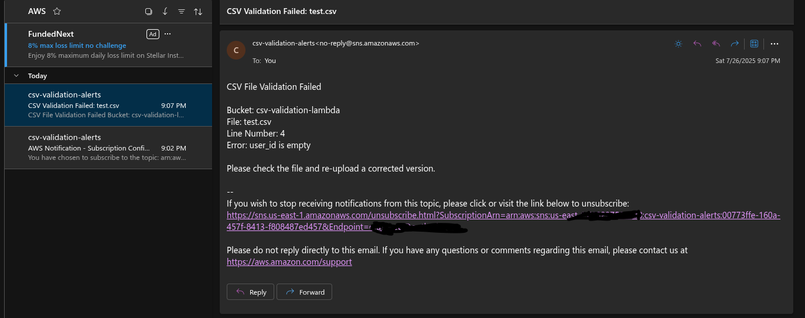
- Valid file should not trigger any notification

## Common Troubleshooting

### Function Not Triggering

1. **Check S3 trigger configuration**:
   - Go to Lambda function → Configuration → Triggers
   - Verify S3 trigger exists with correct bucket and .csv suffix

2. **Check file naming**:
   - Ensure uploaded files have `.csv` extension
   - File names are case-sensitive

### No SNS Notifications

1. **Verify environment variable**:
   - Lambda → Configuration → Environment variables
   - Check `SNS_TOPIC_ARN` is correct

2. **Check email subscription**:
   - SNS → Topics → your topic → Subscriptions
   - Status should be "Confirmed"

### Permission Errors

1. **Check IAM role**:
   - IAM → Roles → CSVValidatorLambdaRole
   - Verify custom policy has correct bucket name and SNS ARN

2. **Check CloudWatch logs** for specific error messages

### Function Timeout

1. **Increase timeout**:
   - Lambda → Configuration → General configuration
   - Increase timeout value for large files

---

## Security Best Practices

1. **Limit S3 permissions** to specific bucket paths if needed
2. **Use least-privilege** IAM policies
3. **Enable CloudTrail** for audit logging
4. **Consider VPC** deployment for sensitive workloads
5. **Encrypt SNS messages** if handling sensitive data

---

## Cost Estimates

**Typical monthly costs for moderate usage:**

- Lambda: $0.20 per 1M requests + $0.00001667 per GB-second
- SNS: $0.50 per 1M publishes + $0.06 per 100K email deliveries
- S3: Standard storage and request charges
- CloudWatch: Logs storage and API calls

**Example**: 1,000 CSV files/month ≈ $1-2 total
